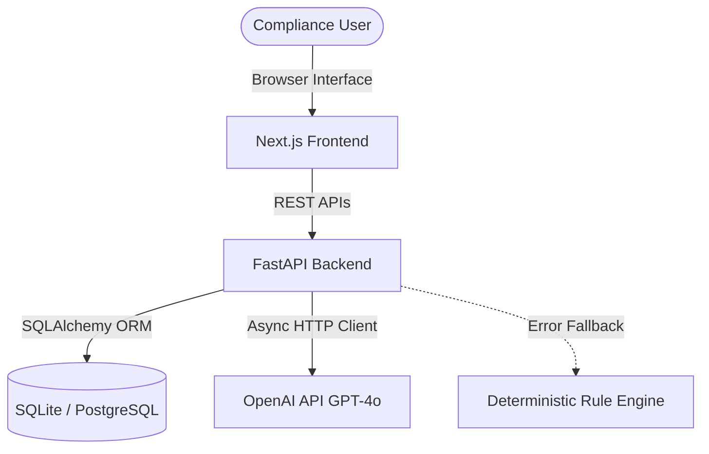

# RegLoop AI

RegLoop AI is a single-user compliance review platform designed to turn complex regulatory updates into a structured, reviewable compliance package with automated audit trails and policy pull request recommendations.
---

## Project Status: MVP Fully Implemented & Verified
The MVP has been fully implemented, dockerized, and verified against all Topcoder challenge specifications:
* **8 / 8 Functional Requirements (FR-1 through FR-8)** are fully implemented and verified.
* **Deterministic Fallback Engine** is fully implemented so all ingestion, mappings, gap analyses, and policy PRs can run completely offline without an LLM provider key.
* **43 / 43 Pytest Integration and Unit Tests** are passing successfully in the `tests/` directory.
* **Fully Dockerized Stack**: The entire full-stack app (React/Next.js frontend, FastAPI backend, PostgreSQL database, and optional Adminer viewer) boots using a single command: `docker compose up --build -d`.

---

## Workflow Overview

1. **Upload Workspace (FR-1)**: Import a regulatory PDF, one to three internal policy PDFs, and a responsibility matrix CSV.
2. **Obligation Extraction (FR-2)**: Extract structured compliance mandates with citations and confidence scores using LLMs.
3. **Policy Mapping (FR-3)**: Map regulatory obligations to internal policy sections.
4. **Gap Analysis (FR-4)**: Assess coverage (Fully, Partially, or Not Covered) and assign risk ratings.
5. **Policy PR Generation (FR-5)**: Draft policy amendments, complete with suggested owners and before-and-after text comparisons.
6. **Human Review (FR-6)**: Approve, reject, modify, or escalate changes with comments.
7. **Audit Trail (FR-7)**: Log a timeline of actions from the source document to the final decision.
8. **Export (FR-8)**: Export the complete package as structured JSON or flat CSV.

---

## Technical Stack

| Layer | Technology | Description |
|---|---|---|
| **Frontend** | React 19, Next.js 16, TypeScript | Single Page App, local-storage workspace tracking |
| **Backend** | Python 3.11/3.12, FastAPI | Asynchronous REST endpoints, structured logging |
| **Database** | SQLite / PostgreSQL | Portability via SQLAlchemy 2 + Alembic migrations |
| **AI Layer** | OpenAI (GPT-4o) / Offline Fallback | Provider-neutral REST requests using `httpx` |

---

## Architecture & System Design



* **Client Tier**: Fully decoupled Next.js application using Vanilla CSS. Workspace session tracking is preserved locally using browser `localStorage`.
* **Application Tier**: ASGI FastAPI server with modular router design (`/api/workspaces`, `/api/policy-pull-requests`) and isolated domain services.
* **Storage Tier**: Relational schema portable between a fast local development database (SQLite) and production-ready containers (PostgreSQL).
* **Intelligence Tier**: Non-blocking asynchronous REST calls matching Pydantic output schemas.

---

## AI Layer & Fallback Strategy

To ensure that development remains cost-free, unit tests pass instantly without a network, and production environments never crash, the system implements a strict **automatic fallback pattern**:

1. **Provider Check**: The backend evaluates `LLM_PROVIDER` and `OPENAI_API_KEY`.
2. **LLM Path**: If credentials are active, calls are made asynchronously via `httpx` using OpenAI JSON-mode schemas.
3. **Local Fallback**: If the key is invalid, missing, or runs out of credits (returns `429 Insufficient Quota`), the server catches the failure, logs a warning, and executes deterministic rule-based mapping (keyword matching, structural heuristics, and text-templating).
4. **Schema Safety**: Both paths return structured responses validated against the same Pydantic schemas (e.g., [GapAnalysisOutput](file:///C:/Users/Public/Projects/RegLoop%20AI/backend/app/services/gap_analysis.py#L67-L88)), preventing UI format crashes.

---

## Quick Start — Local Development

### Prerequisites
* **Node.js** 20+
* **Python** 3.11+
* **npm** 10+

### 1. Backend Setup (SQLite)
Navigate to the backend directory, initialize a virtual environment, install dependencies, and start the development server:

```bash
cd backend
python -m venv .venv

# Windows:
.venv\Scripts\activate
# macOS/Linux:
source .venv/bin/activate

pip install -r requirements.txt
cp .env.example .env
uvicorn app.main:app --reload
```
* **API Server**: `http://localhost:8000`
* **Swagger OpenAPI Docs**: `http://localhost:8000/docs`

### 2. Frontend Setup
Navigate to the frontend directory, install npm packages, and launch the hot-reloading development server:

```bash
cd frontend
cp ../.env.example .env.local  # configures NEXT_PUBLIC_API_URL
npm install
npm run dev
```
* **Frontend UI**: `http://localhost:3000`

---

## Running with Docker Compose (PostgreSQL)

Build and run all services in a single command using PostgreSQL as the primary database:

```bash
# 1. Set credentials in root environment config
cp .env.example .env

# 2. Build and boot services
docker compose up --build
```

| Service | Port | Endpoint URL |
|---|---|---|
| **Next.js Web Interface** | `3000` | http://localhost:3000 |
| **FastAPI REST API** | `8000` | http://localhost:8000 |
| **Adminer Database Viewer** | `8080` | http://localhost:8080 (Run with `--profile tools`) |

---

## Automated Testing & Quality Checks

### Run Backend Tests (Pytest)
Executes all unit, integration, and export package tests (dynamically bypassing LLM calls when key is offline):
```bash
cd backend
.venv\Scripts\pytest
```

### Run Frontend Code Linter
Verifies React hooks, JSX markup formatting, and types:
```bash
cd frontend
npm run lint
```

### Run Production Build
Verifies TypeScript compilation and Next.js static site generation optimization:
```bash
cd frontend
npm run build
```

---

## Project Documentation Index

All technical specifications, design diagrams, and setup instructions are located in the [`docs/`](docs/) folder:
* [Architecture Specifications](docs/architecture.md) — Subsystem designs and directory outlines.
* [Data Model Specs](docs/data-model.md) — Database tables, constraints, and schemas.
* [API Contract](docs/api-contract.md) — REST endpoint schemas.
* [AI Workflow](docs/ai-workflow.md) — LLM prompt engineering guidelines.
* [Setup Instructions](docs/setup-instructions.md) — Server environment instructions.
* [Known Limitations](docs/limitations.md) — Scope limits, SQLite locking, and git boundaries.
