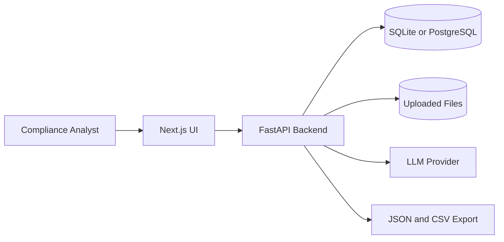
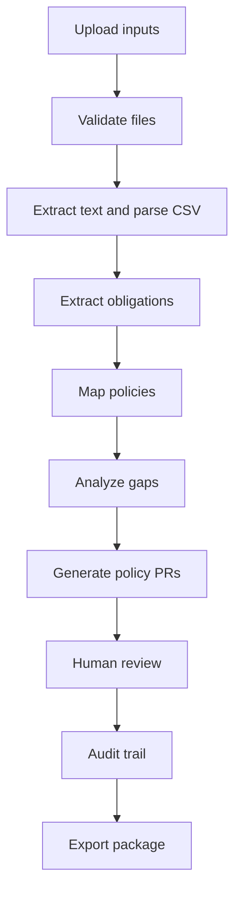

# Architecture

## System Context

RegLoop AI is a local/prototype web application with a Next.js frontend, FastAPI backend, relational database, local file storage, and an LLM provider.

## Backend Modules

- Uploads: validates PDFs and CSV, stores metadata, supports replacement.
- Ingestion: extracts PDF text, parses CSV, chunks policy text.
- AI Orchestration: calls LLM providers and validates structured outputs.
- Obligations: persists extracted regulatory obligations.
- Mapping: maps obligations to policy sections.
- Gap Analysis: evaluates coverage and risk.
- Policy PRs: generates reviewable policy amendments.
- Review: persists human decisions and modifications.
- Audit: creates traceable history records.
- Export: produces JSON and CSV review packages.

## Frontend Screens

- Workspace: upload required inputs and show readiness.
- Analysis Progress: show current processing stage and errors.
- Obligations: table of extracted obligations.
- Policy Mapping: obligation-by-obligation policy matches.
- Gap Analysis: coverage and risk view.
- Policy Pull Requests: reviewable before/after recommendations.
- Human Review: approve, reject, modify, escalate.
- Audit Trail: end-to-end traceability.
- Export: download JSON or CSV package.

## Data Flow

## Deployment Shape

Development can run with local processes and SQLite. Production-like demo runs should use Docker Compose with PostgreSQL:

- `frontend`: Next.js app
- `backend`: FastAPI app
- `postgres`: PostgreSQL database
- optional `adminer` or similar database inspection service

## Key Design Decisions

- No authentication because the challenge specifies a single-user prototype.
- Use relational persistence for traceability and export consistency.
- Store uploaded files separately from extracted normalized text.
- Validate all model outputs against explicit schemas before persisting.
- Keep LLM provider integration behind a small interface.
